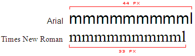
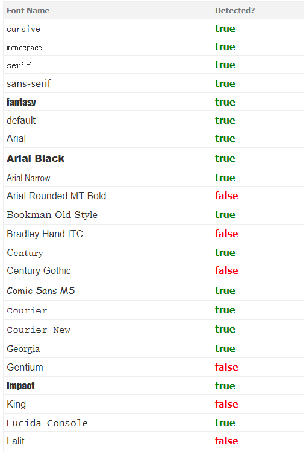

## JavaScript / CSS 字体检测器 

使用 JavaScript 和 CSS 检测用户浏览器中特定字体的可用性。几乎 100％ 准确。 [Demo](https://f2ex.github.io/fontdetect.js/demo/)

## 简介

这个 JavaScript 可以用来检测用户机器中是否存在特定的字体。当桌面端的 Web 应用程序开发人员希望为其用户提供不同的外观或字体首选项时，这可能是有帮助的。  

这也可能对博客皮肤设计者有帮助，可以根据机器上的字体列表为不同的用户提供不同的字体。设计师不必依赖最常见的字体，如 Arial，Verdana 或 Times New Roman。

由于越来越多的用户使用最新操作系统/应用程序的现代 PC ，它们在其机器中可能安装有广泛的其他常见字体。

## 它是如何工作的？

该代码的原理非常简单，每个字符在不同的字体中显示不同。因此，不同的字体对于相同字体大小的相同字符串将采用不同的宽度和高度。

我们尝试创建一个带有3个通用字体，等宽字体，无衬线和无名字体的字符串，并记下其宽度。然后尝试使用要测试的字体和通用后备字体在 HTML 中创建相同的字符串。如果字体不可用，则会占用通用的后备字体。然后，我们将字符串的宽度与新字体的宽度和字符串的宽度进行比较，如果它们不同，那么字体存在，否则不存在。

` mmmmmmmmmmlli `  
与  
` mmmmmmmmmmlli `

由于该测试对3个字体系列重复三次，因此几乎可以获得 100％ 准确的结果。我们将用于生成宽度的字符串可以是任何东西。但是我建议我们使用 'm' 或 'w' ，因为这两个字符占用最大宽度。而且我们在末尾使用 'l' 和 'i' ，使得相同宽度的字体面可以根据l个字符的宽度分离。我已经在 Firefox，IE，Opera，Safari，Chrome 上测试通过。

## 测试效果

使用 JS    

    window.onload = function() {  
        var detective = new Detector();
        alert(detective.detect('font name'));
    };

测试效果  

## 注意

它需要脚本被浏览器完全加载后执行。（Opera 在所有的父元素完全加载前，无法计算 offsetWidth 。）

## 声明

本项目也就是 fontdetect.js 的原作者是 [Lalit Patel](http://www.lalit.org/) 。[原项目主页](http://www.lalit.org/lab/javascript-css-font-detect/) 由于众所周知的原因在国内无法打开，因此由本文作者将其移动到 Github 上供大家方便学习。

## LICENSE

[Apache Software License 2.0](LICENSE)

